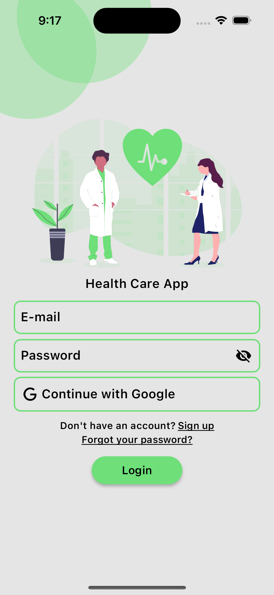

<h3 align="center">HealthCare app</h3>

  

    HealthCare App is a comprehensive application designed to assist you in maintaining and improving your health. This app offers a range of features tailored to your needs, including:

<ul>
  <li>Finding hospitals in your vicinity for emergencies or routine check-ups.</li>
  <li> Locating nearby pharmacies to purchase medications and health supplies.</li>
  <li>Setting reminders and notifications for taking your medications.</li>
  <li>Adding and managing appointments in your calendar to keep track of your medical visits and health-related events.</li>
  <li>Creating detailed medical notes and importing data from PDF files for better record-keeping and organization.</li>
  <li>Engaging with a chatbot for quick assistance and answers to health-related queries.</li>
</ul>

    With the HealthCare app, you can manage your health effectively and stay on top of your medical needs with ease. Whether it's finding the nearest hospital or setting a reminder for your medication, this app is your trusted partner in health management.

<table>
  <tr>
    <td align="center">
      
    </td>
    <td align="center">
      
    </td>
  </tr>
  <tr>
    <td align="center">Login Screen</td>
    <td align="center">Home Screen</td>
  </tr>
</table>
<h3>Technical Details:</h3>

    The HealthCare app is built using Flutter, a powerful framework for building natively compiled mobile applications. This allows the app to be available on both iOS and Android platforms, providing a seamless experience across devices.

    Additionally, the app leverages Firebase for backend services, ensuring robust data management and real-time updates. Each user has their own profile for personalized health management. Users can sign in using their email or Google account, and they have the ability to reset their password if forgotten, ensuring a secure and user-friendly experience.

<h3 align="center">APIs Used</h3>
<table>
  <tr>
    <th>API</th>
    <th>Purpose</th>
  </tr>
  <tr>
    <td>OpenAI API</td>
    <td>This API is used to interact with OpenAI's GPT-3.5-turbo model. It provides the functionality to generate responses from ChatGPT based on user prompts.</td>
  </tr>
  <tr>
    <td>Geoapify Places API</td>
    <td>This API is used to find nearby healthcare facilities such as pharmacies and hospitals based on the user's location.</td>
  </tr>
</table>

<h3 align="center">Libraries Used</h4>

<table>
  <tr>
    <th>Library</th>
    <th>Version</th>
    <th>Description</th>
  </tr>
  <tr>
    <td>flutter</td>
    <td>SDK</td>
    <td>The Flutter framework.</td>
  </tr>
  <tr>
    <td>flutter_localizations</td>
    <td>SDK</td>
    <td>Localization support for Flutter.</td>
  </tr>
  <tr>
    <td>flutter_svg</td>
    <td>^2.0.10+1</td>
    <td>SVG rendering and widget library.</td>
  </tr>
  <tr>
    <td>material_design_icons_flutter</td>
    <td>^7.0.7296</td>
    <td>Material Design Icons for Flutter.</td>
  </tr>
  <tr>
    <td>location</td>
    <td>^5.0.3</td>
    <td>Location services for Flutter apps.</td>
  </tr>
  <tr>
    <td>http</td>
    <td>^1.1.0</td>
    <td>A composable, Future-based library for making HTTP requests.</td>
  </tr>
  <tr>
    <td>latlong2</td>
    <td>^0.9.0</td>
    <td>A library for latitude and longitude calculations.</td>
  </tr>
  <tr>
    <td>flutter_map</td>
    <td>^6.1.0</td>
    <td>An interactive map widget for Flutter.</td>
  </tr>
  <tr>
    <td>url_launcher</td>
    <td>^6.2.1</td>
    <td>A plugin for launching a URL in the mobile platform.</td>
  </tr>
  <tr>
    <td>flutter_native_splash</td>
    <td>^2.3.2</td>
    <td>Automatically generates native code for adding splash screens in Flutter.</td>
  </tr>
  <tr>
    <td>flutter_launcher_icons</td>
    <td>^0.13.1</td>
    <td>A command-line tool which simplifies the task of updating your Flutter app's launcher icon.</td>
  </tr>
  <tr>
    <td>animated_toggle_switch</td>
    <td>^0.6.2</td>
    <td>A Flutter package for an animated toggle switch widget.</td>
  </tr>
  <tr>
    <td>table_calendar</td>
    <td>^3.0.9</td>
    <td>A highly customizable, feature-packed calendar widget for Flutter.</td>
  </tr>
  <tr>
    <td>intl</td>
    <td>^0.18.1</td>
    <td>Internationalization and localization support.</td>
  </tr>
  <tr>
    <td>firebase_core</td>
    <td>^2.27.2</td>
    <td>Flutter plugin for Firebase Core.</td>
  </tr>
  <tr>
    <td>firebase_auth</td>
    <td>^4.18.0</td>
    <td>Flutter plugin for Firebase Authentication.</td>
  </tr>
  <tr>
    <td>flutter_local_notifications</td>
    <td>^16.1.0</td>
    <td>A plugin for displaying local notifications in a Flutter application.</td>
  </tr>
  <tr>
    <td>dropdown_button2</td>
    <td>^2.3.9</td>
    <td>A Flutter package for a customizable dropdown button.</td>
  </tr>
  <tr>
    <td>cloud_firestore</td>
    <td>^4.15.10</td>
    <td>Flutter plugin for Cloud Firestore, a NoSQL document database.</td>
  </tr>
  <tr>
    <td>flutter_slidable</td>
    <td>^3.1.0</td>
    <td>A Flutter package for a slidable list item widget.</td>
  </tr>
  <tr>
    <td>motion_toast</td>
    <td>^2.9.0</td>
    <td>A Flutter package for animated toast messages.</td>
  </tr>
  <tr>
    <td>google_sign_in</td>
    <td>^6.2.1</td>
    <td>A Flutter plugin for Google Sign-In.</td>
  </tr>
  <tr>
    <td>permission_handler</td>
    <td>^11.3.1</td>
    <td>A Flutter package for handling permissions.</td>
  </tr>
  <tr>
    <td>syncfusion_flutter_pdf</td>
    <td>^25.1.39</td>
    <td>A Flutter package for creating and manipulating PDF files.</td>
  </tr>
  <tr>
    <td>flutter_speed_dial</td>
    <td>^7.0.0</td>
    <td>A Flutter package for creating a speed dial widget.</td>
  </tr>
  <tr>
    <td>file_picker</td>
    <td>^8.0.0+1</td>
    <td>A Flutter plugin for picking files from the file system.</td>
  </tr>
</table>

<h3>Team Members</h3>
<ul>
  <li><b>Julia Gościniak</b></li>
  <li><b>Katarzyna Hajduk</b></li>
  <li><b>Jakub Budziło</b></li>
</ul>

<a href="https://www.figma.com/file/HY55AkH50Bau92gsBx8jg1/Health-Care-App?type=design&node-id=0%3A1&mode=design&t=u9xxscf3deYHCqK3-1">View the Figma Design</a>
